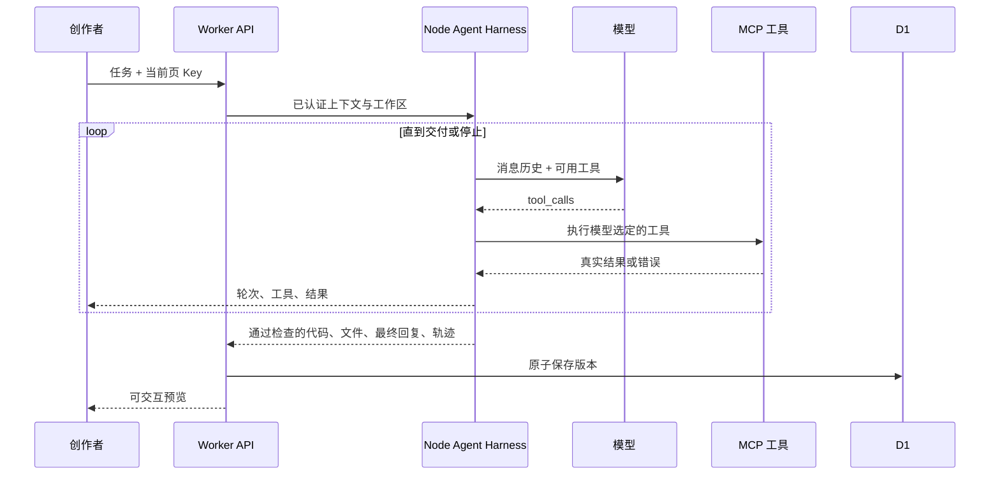

# Atmos

一个 Atoms 风格的 AI 应用创作工作台：输入需求，由 Agent 自主调用工具并生成单页应用，在隔离预览中直接操作，再通过对话继续迭代。

> 无密钥可体验三个预置模板。自由生成与修改需要体验者在设置中填写自己的模型 API Key。模板模式与 AI 生成模式在界面中明确区分。

## 交付状态

**正式 Demo：** [https://atmos-production-d92c.up.railway.app](https://atmos-production-d92c.up.railway.app)；**公开源码：** [https://github.com/icyymilk/atmos-demoa](https://github.com/icyymilk/atmos-demoa)。线上实例已验证健康检查、模板创建、状态保存和服务重启后的数据持久化。部署结构、HTTPS 入口和持久化配置见 [部署说明](docs/DEPLOYMENT.md)。

可直接使用的 [提交说明](docs/SUBMISSION.md) 与 [验收矩阵](docs/RELEASE-CHECKLIST.md) 已整理；公网与有效模型 Key 验收必须通过后再填写正式链接。

## 已实现

- 天蓝色中文创作首页、示例模板、项目列表与搜索；系统字体、统一线性图标、可收起侧栏、桌面双栏工作台、手机对话/应用切换。支持键盘快捷键、焦点返回、减少动态效果和服务健康检查。
- Canvas 粒子轨道与鼠标轻交互；支持手动暂停、系统减少动态效果，并在页面隐藏或粒子区域离屏时停止绘制。
- DeepSeek、OpenAI、OpenRouter、通义千问四种 OpenAI 兼容服务，可修改模型 ID；支持真实短请求测试连接、配置取消与服务偏好记忆（不记忆 Key）。
- Agent Harness：模型决策 → MCP 工具执行 → 工具结果回传 → 继续决策，直到交付检查通过或达到停止条件。无固定阶段或固定修复次数。
- 真实网页读取、Exa 网络搜索、隔离文件读写与精确编辑、项目内检索、任务清单、项目记忆。
- 本机插件目录与 SKILL.md 按需加载，支持 stdio / HTTP / SSE MCP；界面可启停插件和查看工具调用轨迹。
- SSE 实时展示公开进度说明、实际模型轮次、工具参数、结果、耗时与剩余预算；默认 30 次总调用 / 单轮 4 次 / 联网 6 次，截断最多恢复 2 次，支持分块写入；支持停止生成、认证失败、限流、超时、长度截断等反馈。
- 实时工作区：生成草稿、真实文件树、代码变化、跟随 Agent 与暂停跟随；通过检查的代码自动更新实验预览，停止后可恢复查看快照。
- iframe 中真实运行 HTML/CSS/JS；桌面/手机宽度切换、源码查看、复制。
- Cloudflare D1 保存项目、版本、应用状态；本地运行使用本机 SQLite，无需云端账号。未同步的应用状态暂存于当前标签页的 sessionStorage，刷新后重试保存；成功同步后移除备份。
- 任务看板、记账本、番茄钟三个可交互模板。
- 重命名、删除、版本查看与恢复（追加新版本）、完整工作区 ZIP 和独立 HTML 导出。
- ZIP 导出可选择包含当前应用数据；独立 HTML 导出携带当前应用数据，后续改动保存到该文件所在浏览器的 localStorage。

## 技术栈与取舍

| 层 | 实现 |
| --- | --- |
| UI | React 19、TypeScript、手写 CSS、Lucide 图标 |
| 全栈框架 | Vinext / Vite，Next.js App Router 风格 |
| 部署 | Docker 化 Node 22 服务；Railway HTTPS 与持久卷 |
| 数据 | Cloudflare D1（SQLite）、Drizzle schema / migrations、参数化 SQL |
| 智能体运行层 | Node.js Harness，自主工具循环、上下文管理、预算与交付检查 |
| 工具与扩展 | 官方 MCP TypeScript SDK、stdio / HTTP / SSE、plugin.json、SKILL.md |
| 模型协议 | OpenAI 兼容 Chat Completions，流式 SSE |
| 执行环境 | `iframe sandbox="allow-scripts allow-forms"` + 预置 CSP |

采用单文件原生 Web 应用，而非任意 Node.js 工程生成。这样无需启动容器、安装未知依赖或等待打包，能在一次生成后立即预览并导出。代价是不能直接生成含服务端、npm 依赖和外部 API 的完整工程。

Vinext 与当前 Sites 部署工具配套，降低这次 Demo 的发布成本；它仍是较新的框架。长期维护应评估成熟 Next.js 部署或独立 Vite + API 服务。UI、模型服务与数据访问模块已分离，可逐步迁移。

## 本地运行

要求 Node.js **22.13+**，npm，网络可访问 npm registry。

```sh
npm ci
npm run dev  # 自动初始化/更新本地数据库，再启动开发服务
```

打开终端输出的 Local 地址，默认 `http://localhost:5173`。本地 D1 位于忽略提交的 `.wrangler/state`。无需先构建或登录 Cloudflare；正常开发支持 HMR。`npm run db:setup` 可单独重复执行，已有项目与数据会保留。

```sh
npm run typecheck
npm test
npm run test:integration  # 需保持本地开发服务器运行
```

`test:integration` 默认访问 localhost:5173，可用 `ATMOS_TEST_URL` 指定测试实例。它创建隔离访客会话和测试项目，并在测试结束后删除这些测试项目；还会使用明确无效的测试 Key 检查模型失败通道，不调用付费成功生成。

查看生产构建的本地运行效果：先运行 `npm run build`，再运行 `npm start`。模型 Key 由页面填写，无需 `.env` 或服务端共享密钥。默认模型名称可能随提供方变化，可在界面修改。

架构、插件配置与验证方法见 [Harness 工程说明](docs/HARNESS.md)。

## 关键目录

```text
app/page.tsx                       创作空间、工作台与交互
app/globals.css                    响应式界面样式
app/api/session/route.ts           建立访客会话
app/api/generate/route.ts          鉴权、转发 Agent 事件、原子提交
harness/                         Agent 循环、模型协议、MCP、插件、隔离工作区
plugins/                         开发 Skill、Exa、stdio 工具示例
app/api/projects/                  查询、状态保存、重命名、删除、恢复
lib/generator.ts                  连接测试、应用契约与结构检查
lib/preview.ts                    CSP、预览数据桥、独立导出
lib/templates.ts                  三个真实交互模板
lib/storage.ts                    D1访问、会话校验、边界处理
lib/types.ts                      项目类型与模型配置
db/schema.ts                     数据表定义
drizzle/                         已生成的 SQL 迁移
tests/                           流式协议、预览契约与 API 测试
docs/SUBMISSION.md                提交说明和演示步骤
```

## 数据与执行流程



- 数据库包含 `owners`、`users`、`sessions`、`projects`、`versions` 和 `auth_attempts`。项目归属稳定的 owner，登录会话只负责认证。
- 访客 Cookie 为随机 256 位值，HttpOnly / SameSite=Strict，HTTPS 使用 Secure。数据库只保存其 SHA-256 摘要，并检查 30 天有效期。
- 项目的所有查询与变更都检查 owner；不提供按任意用户 ID 读取的接口。
- 应用数据与版本代码分开保存。浏览历史版本时，预览操作不会保存到当前应用；恢复代码不会删除应用数据；如果历史代码与新数据结构不兼容，需要手动修复或新建项目。
- 版本按项目加唯一索引，保存使用 D1 batch 和当前版本条件，防止并发生成静默覆盖。
- 每会话最多 50 个项目、每项目最多 40 个代码版本；应用状态最多约 64 KB。
- 模型 API Key 只在 React 内存及当前请求中出现，不保存到数据库、浏览器存储、Cookie、URL 或应用日志。
- 服务端只转发到固定模型域名；使用 Workers 支持的手动重定向模式，拒绝向其他地址转发密钥；模型名称由用户选择，不提供任意代理 URL。
- iframe 不开放同源访问。CSP 禁止网络、外部脚本、frame、对象与表单导航。`allow-forms` 用来让 JS 表单的 submit 事件正常触发；实际网络提交仍被 CSP 阻止。
- 父页面验证消息来源 iframe 和每个预览实例的 channel；只接受状态对象与运行错误，不提供任意文件/网络执行能力。

## 当前边界

1. **真实模型成功生成尚需使用有效 Key 验证。** 已实现实际服务调用，已测试 SSE 解析，并通过真实服务的无效 Key 认证响应验证网络请求通路；不将 mock 或模板当作真实模型生成成功。
2. 结构检查验证完整 HTML、闭合脚本、受支持资源与持久化接口，**不等于功能正确性测试**。运行异常会显示于预览，可带错误信息交给 AI 修复。
3. 支持邮箱密码账户；邮箱尚未验证，没有邮件找回密码。访客未注册时仍依赖 Cookie。跨浏览器登录共享同一服务的数据，不会把本机数据库同步到其他部署实例。
4. 预览不能调用网络，适用于本地交互小工具；无真正的支付、运行时外部数据同步和独立后端部署。Agent 可通过外部连接读取资料来生成应用。
5. 没有生产级的滥用检测、IP 限流、账号恢复、后台任务队列或自动扩缩容策略。
6. 预览基于浏览器沙箱，不能中断生成代码中的无限循环。高风险的任意代码执行需进一步使用独立源与容器资源隔离。
7. 对话携带近期需求和回复、版本文件及项目记忆；尚未实现并行多 Agent、后台队列或停止任务的一键恢复。
8. 当前公网实例是带本地 SQLite/D1 与文件卷的单副本 Node 服务；不支持多副本共享写入，扩容前需迁移到外部事务数据库和对象存储。

## 后续优先级

- **P0**：用真实 Key 做多类需求回归；增加浏览器级自动功能测试与修复循环；补齐邮箱验证、密码找回和项目恢复。
- **P1**：独立预览域名、限流与运行配额；项目分享链接；任务队列与断线重连。
- **P2**：多文件工程、Sandpack 或容器执行器、受控依赖安装、GitHub 同步与独立应用部署。

## 参考

- [Atoms 项目范围与能力](https://help.atoms.dev/zh/articles/12129503-project-scope-capabilities)
- [DeepSeek Chat Completions](https://api-docs.deepseek.com/api/create-chat-completion/)
- [OpenRouter Chat Completions](https://openrouter.ai/docs/api/api-reference/chat/create-a-chat-completion)
- [通义千问 OpenAI 兼容模式](https://help.aliyun.com/zh/model-studio/compatibility-of-openai-with-dashscope)

Atmos 为独立挑战 Demo，不是 Atoms 官方产品。


## 外部服务连接（本地）

侧栏「工具与外部连接」提供 GitHub、GitLab.com、Notion 的令牌连接。连接流程是输入令牌 → 官方服务身份验证 → 加密保存 → 下一次 Agent 任务发现 MCP 工具。支持验证现有连接、更换令牌与断开；使用失败会作为真实工具错误返回 Agent，仍受循环预算限制。

| 服务 | 能力 | 令牌设置 |
| --- | --- | --- |
| GitHub | 列出/搜索仓库，读取文件或目录，读取 Issue/PR 摘要 | [Fine-grained token](https://github.com/settings/personal-access-tokens/new)：选择目标仓库，Contents、Issues 只读 |
| GitLab.com | 列出参与项目，读取目录、文件、Issue | [Personal access token](https://gitlab.com/-/user_settings/personal_access_tokens)：`read_api` |
| Notion | 搜索共享页面、读取页面属性和块内容 | [Internal integration](https://www.notion.so/profile/integrations)：Read content，并将目标页面共享给集成 |

身份验证成功不代表令牌拥有所有资源的访问权；组织审批、仓库选择和页面共享仍由第三方平台控制。本次提供 11 个只读 MCP 工具，不包含 OAuth 登录、仓库推送、PR 创建、评论或文档写入。有效令牌的实际资源读取仍需体验者在界面配置后验收；自动测试使用模拟服务，另有真实 GitHub 无效令牌认证路径验证。

凭据不进入浏览器持久存储、模型提示词或工具参数；读取到的仓库/文档内容会进入当前选择的模型上下文和项目运行记录。令牌按稳定的工作区 owner 隔离，以 AES-256-GCM 保存在 `.atmos/connections/<owner>/`，身份和令牌一起加密，密钥为本机 `.atmos/connections.key`，文件权限 0600。运行时每次调用重新检查连接，断开后后续请求停止，已发出的请求可能完成；已有工具结果和项目版本不会被删除。失效令牌替换失败时保留旧连接。

这是本地凭据保存方案，本机账号能读取加密密钥，不等于托管密钥服务。不要共享 `.atmos` 目录。清除 Cookie 或访客会话过期后无法在界面找回原会话的连接，建议提前断开，并在对应服务撤销不再使用的令牌。

**支持邮箱密码注册和登录**，第三方服务连接仅授予 Agent 读取资料的能力，不会创建或登录 Atmos 账户。


## 账户注册与登录

点击右上角「注册 / 登录」或侧栏访客头像。第一版包含邮箱密码注册、登录、退出、修改密码，同时保留访客体验。密码长度 15–128 个 Unicode 字符，支持空格，不进行自动 trim；邮箱统一去除首尾空格并转为小写。邮箱仅作登录名，尚不验证邮箱，也没有邮件找回密码。

- 注册认领当前访客 owner，项目、版本、运行记录和加密连接凭据原地保留；旧访客会话失效。
- 登录已有账户时不合并访客资料；通过独立 HttpOnly Cookie 保留当前仍有效的访客会话，退出后恢复它，否则创建新访客。
- 登录会话有效期 30 天，Cookie 为 HttpOnly / SameSite=Strict，HTTPS 下使用 Secure。退出撤销当前会话；修改密码撤销该账户所有旧会话，并为当前浏览器签发新会话。
- 密码仅经认证接口送至现有 Node 运行层，使用异步 scrypt（N=131072、r=8、p=1，16 字节随机盐，64 字节输出），最多两个并发哈希任务。D1 保存算法参数、盐和哈希，不保存明文密码。未知邮箱仍进行一次虚拟哈希验证，登录错误统一呈现。
- 登录/注册按规范化邮箱、改密按用户 ID，分别限制每 15 分钟最多 10 次尝试。计数存 D1，Node 重启不会清空计数。
- 运行中的工作区拒绝身份变更；身份变更持锁期间拒绝启动新 Agent。前端通过 BroadcastChannel（不可用时用 storage 事件）、焦点检查及定期校验同步身份，重建工作区 UI 并清空内存 Key。保存队列与运行恢复索引按 owner 隔离，旧组件退休后不能继续派发保存。
- 已安装插件及 Skill 仍由本机配置管理，启停偏好按 owner 单独保存；每个账户只改变自己的启停状态。

接口：`GET /api/auth/me`，`POST /api/auth/register`、`/api/auth/login`、`/api/auth/logout`、`/api/auth/password`。`POST /api/session` 继续初始化访客空间。所有账户变更校验来源、当前会话；前端数据请求携带预期 owner，身份不匹配返回 409。

迁移 `0002_accounts.sql` 为已有会话回填稳定 owner 与过期时间，重建项目外键并复制所有版本。迁移前应备份本地 SQLite；此次本机备份保存在被 Git 忽略的 `.atmos/backups/pre-accounts.sqlite`，其中含私有项目数据，不应上传或共享。恢复备份需先停止服务，并同时使用兼容迁移前结构的代码。

验证命令：`npm test`（包含迁移、密码哈希、隔离及保存队列测试）、`npm run test:auth`（本地真实注册登录接口回归）、`npm run test:integration`、`npm run typecheck`、`npm run lint`、`npm run build`。账户接口测试创建随机测试邮箱和密码，不打印凭据；默认 localhost 测试会清理本次创建的 owner、项目、会话与账户。

## 用户记忆中心（本地）

侧栏「记忆中心」管理当前账户或访客的跨项目知识。新空间包含空白 `USER.md`（档案与偏好）和 `MEMORY.md`（长期经验），不自动填入推测的个人信息。注册沿用稳定 owner，记忆随访客资料一起认领；登录已有账户时不会合并原访客记忆。

- **文档索引**：编辑 Markdown、按标题/内容/标签搜索、标签过滤、新建和导入单篇 `.md`、导出 `.md`、自动生成并导出 `INDEX.md`、完整 JSON 备份导出。预览支持标题、段落、列表、代码块和双向链接，原始 HTML 只作文本，不执行脚本；不是完整 CommonMark 渲染器。
- **关系图谱**：SVG 力导向布局，可拖动节点、平移、缩放、适应全部节点，点击打开文档，显示正向/反向链接。关系仅来自 `[[路径]]`、`[[标题|显示名]]` 的明确引用；名称不唯一或目标缺失时显示未解析链接，不凭空生成语义关系。路径支持省略 `.md`；标题锚点目前只定位文档。
- **确认后才记住**：Agent 的 `memory__propose` 只新增候选，不覆盖文档。用户可修改候选后确认、或忽略。未经确认的候选不会出现在 Agent 的搜索、读取或自动上下文中。用户在编辑器主动保存的文档直接生效。
- **可控个性化**：逐篇暂停或删除、设置常驻、暂停全部跨项目记忆。系统文档可清空或暂停，不能删除。保存有版本冲突保护，409 不覆盖其他窗口的新版本，也不清空当前草稿。刷新列表后可导出草稿并重新载入最新文档。
- **Agent 接入**：启动时优先加载最多 4 篇常驻记忆（系统文档优先），再按中文双字/英文关键词匹配选出最多 3 篇相关文档；常驻文档先加载最多 600 字符，相关文档先加载最多 240 字符，首层正文总计最多 3,200 字符。后续可通过 `memory__search` / `memory__read` 检索与分段读取。三个工具通过官方 MCP 内存传输注册，计入总工具预算，本地记忆检索不占联网预算。当前用户要求优先于旧偏好。
- **使用记录**：显示最近 20 次任务启动时提供的文档、版本及任务摘要；不等于模型一定采纳，也不覆盖后续工具读取。任务运行中的候选提交会有提示，打开记忆中心或点击刷新查看最新候选。

存储为 `.atmos/memory/<稳定 owner>/vault.json`，保存 Markdown 原文、标签、设置、候选与使用记录；以进程内串行事务、临时文件原子替换写入，目录 0700、文件 0600，不放入浏览器持久存储。它是当前 Node 服务的本机持久化存储，**不是多个服务进程共享写入的数据库**。当前不会扫描本机 Markdown 目录、连接 Obsidian vault、同步云端记忆或计算向量嵌入；导出的 Markdown 可以手动用于其他笔记工具。完整 JSON 备份目前只支持导出。

已启用并被选中的记忆会发送给体验者配置的模型服务。全局暂停后工具停止后续读取/提议，但已进入正在运行的模型上下文及项目运行记录的内容不会撤回。删除只影响后续检索和当前记忆库；自行导出的文件和已有项目记录仍需另行处理。常见 API Token / 私钥格式会被拒绝保存，Agent 提议额外检查本次模型 Key；这不等于通用秘密识别，不要将密码或凭据放入记忆。需要部署时，必须为 `.atmos` 配置持久卷、访问控制及备份，未来可将 MemoryStore 换成事务数据库。

接口为 `GET /api/memory` 和 `POST /api/memory`（create/update/delete/settings/approve/reject）。owner 来自经过认证的会话，不接受正文指定的归属；同源校验和 `X-Atmos-Owner` 防止跨站写入和过期界面串用身份。每个空间最多 200 篇文档，每篇 20,000 字符、12 个标签，最多 30 条待确认候选。

验证：`npm test` 包含真实 MCP 调用与模拟模型决策驱动的循环测试；`npm run test:memory` 验证本地真实接口、账户认领、跨浏览器共享、访客恢复、来源与归属校验。还完成了桌面/手机真实浏览器的编辑、导入导出、图谱拖拽缩放、候选修改确认、多窗口冲突、全局开关和刷新持久化检查。真实模型对记忆的理解与生成质量仍需体验者填入有效 Key 后验收。


## 完整项目导出、模型控制与渐进式上下文

- **完整导出**：工作区右上角「导出项目」列出所选版本的全部文件。ZIP 保留原始文件和目录结构（包括项目任务/笔记），附带 `atmos-export/preview.html` 独立运行入口、清单及说明；原始 `index.html` 不改写。可选择带上当前应用数据，默认不带。辅助目录如与原文件冲突会改名。包是完整的生成项目快照，不含 Atmos 本身源码或不存在的 Git 提交历史；解压后可自行 `git init`。账户资料、模型配置 Key、外部连接及用户全局记忆不从服务配置复制进导出包。
- **模型选择**：配置弹窗支持从服务端 `/models` 列表选择模型，也保留手动模型 ID。列表读取失败不会阻止手动配置。输入区显示当前模型 ID 与推理档位，浏览器仅保存非秘密配置；API Key 仍只存页面内存。
- **推理参数**：默认不覆盖模型默认设置；DeepSeek 发送 `thinking.type` 和 `reasoning_effort`，OpenAI 发送 `reasoning_effort`，OpenRouter 使用 `reasoning.effort`，Qwen 使用 `enable_thinking` 和显式思考预算。总输出上限可设置 1,024–32,768 Token；具体可用档位/输出限制取决于模型，API 错误会呈现，不自动降级强度。OpenAI 使用 `max_completion_tokens`，其他服务使用 `max_tokens`。Qwen 的显式思考预算须小于总输出上限。
- **推理协议续接**：DeepSeek `reasoning_content` 和 OpenRouter `reasoning_details`/`reasoning` 仅在服务端当前运行的内存中保留、回传模型，供工具轮次续接。它们不进入公开事件、版本记录或全局记忆。公开进度说明在回复检查通过后展示，等待期间仍显示输出活动和文件草稿。
- **历史渐进加载**：页面首次只取最近 3 轮对话摘要与当前版本完整代码；点击「加载更早对话」每次取 5 条摘要。查看旧版本和展开执行记录时再请求该版本完整文件，已加载内容在当前工作区内复用。旧版无参数项目详情接口保留兼容，应用界面使用 `?view=progressive`。
- **上下文分层**：稳定系统约束 → 近期 2 轮需求/结果节选 → 旧对话索引和相关节选 → 用户记忆首层节选 → 当前任务及工具轮次。`context__search_history`、`context__read_history`、`memory__search`、`memory__read` 提供按需查证；历史仅来自当前项目，记忆仅来自当前 owner。上下文字符预算计入工具定义，保留完整 assistant/tool 配对；旧组压缩为公开工具结果摘录，超大工具定义会提示缩减扩展。界面报告的是字符量，不是模型计费 Token 的精确值。

模型参数核对来源：[DeepSeek Thinking Mode](https://api-docs.deepseek.com/guides/thinking_mode/)、[OpenAI Chat API](https://developers.openai.com/api/reference/resources/chat)、[OpenRouter Reasoning](https://openrouter.ai/docs/guides/best-practices/reasoning-tokens)、[Qwen 深度思考](https://www.alibabacloud.com/help/en/model-studio/deep-thinking)。实际模型权限、思考能力和可用列表仍需体验者有效 Key 验收。

## 工具与回复的 Guardrail

侧栏「信任与审批」按稳定 owner 持久化，默认 **重要询问**，在下一次 Agent 任务启动时读取。运行期间改设置不会绕过当前待审批项。

| 分级 | 行为 |
| --- | --- |
| 总是询问 | 每次工具调用都等待用户批准；回复中的高风险命令建议也需批准后展示 |
| 重要询问 | 常规内置项目读写直接执行；删除、高风险 Bash/Shell 命令、命令执行工具、未知副作用的插件工具需要批准 |
| 完全允许 | 跳过上述人工审批并记录风险放行；仍执行账户鉴权、路径限制、工具预算与预览隔离 |

规则检查删除/批量修改、破坏性 Git 操作和远程推送、提权和系统变更、下载并执行、动态解释、网络传输、依赖安装、命令替换等。未知 MCP 工具按需人工审核，不将其自述的只读标签当作安全保证。规则检查的是参数和公开回复；不是完整 Shell 语法分析器或操作系统沙箱，无法推断外部程序内部行为。此轮未添加任意本机 Bash 执行器，已连接 MCP 的命令工具经过同一执行门；MCP 服务启动程序仍由本机插件配置管理。

待审批卡展示完整操作内容、原因、运行标识关联与 SHA-256 指纹；用户只能批准或拒绝原始操作，不能在批准请求中替换参数。审批在服务端绑定 owner、run ID、唯一审批 ID 与原始工具参数，一次使用后立即失效；拒绝通过工具错误反馈给模型选择替代方案。公开回复里的危险命令先缓存在服务端，批准仅允许展示建议，不代表批准执行。命令工具仍独立经过执行前检查。

等待最长 5 分钟，也受当前运行总超时约束；取消、断开或服务重启不恢复旧审批。批准不能复用到其他用户、运行或下一次调用。已有任务的完整操作只在实时审批卡中展示，保存的审计记录会截取长参数，指纹不变。信任设置位于 `.atmos/owners/<owner>/trust.json`，原子写入并检查版本冲突。

接口：`GET/POST /api/security`、`POST /api/runs/:id/approval`、`POST /api/models/list`、`GET /api/projects/:id/history?before=...`、`GET /api/projects/:id/versions/:number`。

验证命令增加 `npm run test:controls`（真实本地鉴权/分页/参数接口）与 `npm run test:guard`（独立临时 Harness、真实 HTTP + MCP 副作用、模型决策用测试夹具）。单元测试验证 ZIP 可被 Python zipfile 解压校验、推理参数映射与私有协议隔离、上下文边界、审批拒绝/过期/防重放。浏览器检查覆盖完整下载、懒加载旧版本、模型设置、信任持久化、桌面和手机审批交互；模型列表及实时审批流使用浏览器夹具，实际执行安全由独立 Harness 测试验证。测试不使用或打印用户真实 Key。


## 交付打磨与检查

界面按 Apple HIG 的可读性、层级和一致性原则调整：使用操作系统字体（不打包 Apple 字体）、统一 Lucide 图标线宽和尺寸，减少装饰性字符，保持天蓝色强调、浅色导航、稳定工具栏。正文与辅助文字按层级调大并提高对比度。支持侧栏收起、手机导航焦点约束、原生 dialog、Esc 与返回焦点；⌘ / Ctrl + K 聚焦输入，⌘ / Ctrl + , 配置模型，⌘ / Ctrl + \ 切换侧栏。

参考：[Apple Typography](https://developer.apple.com/design/human-interface-guidelines/typography)、[Sidebars](https://developer.apple.com/design/human-interface-guidelines/sidebars)、[Design principles](https://developer.apple.com/design/human-interface-guidelines/design-principles)。这是 Web 端对指南原则的应用，不是原生 macOS 控件或官方认证。

`npm run check` 运行类型检查、Lint、单元测试和构建。`npm run test:ui` 提供可复现的浏览器流程；首次先 `npx playwright install chromium`，或用 `ATMOS_BROWSER_CHANNEL=chrome` 指定本机 Chrome。`npm run test:deployment` 在编译后服务上使用干净数据库，验证 HTTPS 来源检查、Secure Cookie、账户和重启后的持久化。

数据库初始化关闭 Wrangler 的在线版本提示，避免迁移已经完成但更新请求仍占用进程导致启动停住。`GET /api/health` 同时检查数据库与 Node Harness，任一未就绪返回 503；不会返回账户、凭据或内部运行目录。
