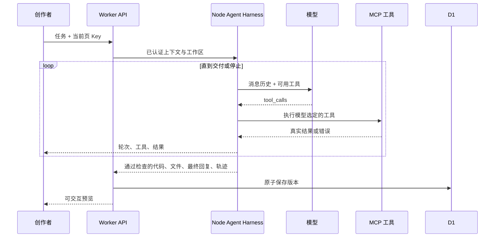

# Atmos

一个 Atoms 风格的 AI 应用创作工作台：输入需求，由 Agent 自主调用工具并生成单页应用，在隔离预览中直接操作，再通过对话继续迭代。

> 无密钥可体验三个预置模板。自由生成与修改需要体验者在设置中填写自己的模型 API Key。模板模式与 AI 生成模式在界面中明确区分。

## 交付状态

**当前以本地版本为验收入口。** 公开部署地址：[Atmos Demo](https://atmos-builder-cyx.pale-earth-3846.chatgpt.site)。平台已报告部署成功，但当前执行环境访问该域名触发 Cloudflare 403，尚未完成外网可访问性验收。可先使用下方本地运行步骤体验。GitHub public 仓库待指定。

## 已实现

- 天蓝色中文创作首页、示例模板、项目列表与搜索；桌面双栏工作台、手机对话/应用切换。
- Canvas 粒子轨道与鼠标轻交互；支持手动暂停、系统减少动态效果，并在页面隐藏或粒子区域离屏时停止绘制。
- DeepSeek、OpenAI、OpenRouter、通义千问四种 OpenAI 兼容服务，可修改模型 ID；支持真实短请求测试连接、配置取消与服务偏好记忆（不记忆 Key）。
- Agent Harness：模型决策 → MCP 工具执行 → 工具结果回传 → 继续决策，直到交付检查通过或达到停止条件。无固定阶段或固定修复次数。
- 真实网页读取、Exa 网络搜索、隔离文件读写与精确编辑、项目内检索、任务清单、项目记忆。
- 本机插件目录与 SKILL.md 按需加载，支持 stdio / HTTP / SSE MCP；界面可启停插件和查看工具调用轨迹。
- SSE 实时展示公开进度说明、实际模型轮次、工具参数、结果、耗时与剩余预算；默认 30 次总调用 / 单轮 4 次 / 联网 6 次，截断最多恢复 2 次，支持分块写入；支持停止生成、认证失败、限流、超时、长度截断等反馈。
- iframe 中真实运行 HTML/CSS/JS；桌面/手机宽度切换、源码查看、复制。
- Cloudflare D1 保存项目、版本、应用状态；本地运行使用本机 SQLite，无需云端账号。未同步的应用状态暂存于当前标签页的 sessionStorage，刷新后重试保存；成功同步后移除备份。
- 任务看板、记账本、番茄钟三个可交互模板。
- 重命名、删除、版本查看与恢复（追加新版本）、独立 HTML 导出。
- 导出文件包含当前应用数据，后续改动保存到该文件所在浏览器的 localStorage。

## 技术栈与取舍

| 层 | 实现 |
| --- | --- |
| UI | React 19、TypeScript、手写 CSS、Lucide 图标 |
| 全栈框架 | Vinext / Vite，Next.js App Router 风格 |
| 部署 | Cloudflare Workers，经 Sites 发布 |
| 数据 | Cloudflare D1（SQLite）、Drizzle schema / migrations、参数化 SQL |
| 智能体运行层 | Node.js Harness，自主工具循环、上下文管理、预算与交付检查 |
| 工具与扩展 | 官方 MCP TypeScript SDK、stdio / HTTP / SSE、plugin.json、SKILL.md |
| 模型协议 | OpenAI 兼容 Chat Completions，流式 SSE |
| 执行环境 | `iframe sandbox="allow-scripts allow-forms"` + 预置 CSP |

采用单文件原生 Web 应用，而非任意 Node.js 工程生成。这样无需启动容器、安装未知依赖或等待打包，能在一次生成后立即预览并导出。代价是不能直接生成含服务端、npm 依赖和外部 API 的完整工程。

Vinext 与当前 Sites 部署工具配套，降低这次 Demo 的发布成本；它仍是较新的框架。长期维护应评估成熟 Next.js 部署或独立 Vite + API 服务。UI、模型服务与数据访问模块已分离，可逐步迁移。

## 本地运行

要求 Node.js **22.13+**，npm，网络可访问 npm registry。

```sh
npm ci
npm run dev  # 自动初始化/更新本地数据库，再启动开发服务
```

打开终端输出的 Local 地址，默认 `http://localhost:5173`。本地 D1 位于忽略提交的 `.wrangler/state`。无需先构建或登录 Cloudflare；正常开发支持 HMR。`npm run db:setup` 可单独重复执行，已有项目与数据会保留。

```sh
npm run typecheck
npm test
npm run test:integration  # 需保持本地开发服务器运行
```

`test:integration` 默认访问 localhost:5173，可用 `ATMOS_TEST_URL` 指定测试实例。它创建隔离访客会话和测试项目，并在测试结束后删除这些测试项目；还会使用明确无效的测试 Key 检查模型失败通道，不调用付费成功生成。

查看生产构建的本地运行效果：先运行 `npm run build`，再运行 `npm start`。模型 Key 由页面填写，无需 `.env` 或服务端共享密钥。默认模型名称可能随提供方变化，可在界面修改。

架构、插件配置与验证方法见 [Harness 工程说明](docs/HARNESS.md)。

## 关键目录

```text
app/page.tsx                       创作空间、工作台与交互
app/globals.css                    响应式界面样式
app/api/session/route.ts           建立访客会话
app/api/generate/route.ts          鉴权、转发 Agent 事件、原子提交
harness/                         Agent 循环、模型协议、MCP、插件、隔离工作区
plugins/                         开发 Skill、Exa、stdio 工具示例
app/api/projects/                  查询、状态保存、重命名、删除、恢复
lib/generator.ts                  连接测试、应用契约与结构检查
lib/preview.ts                    CSP、预览数据桥、独立导出
lib/templates.ts                  三个真实交互模板
lib/storage.ts                    D1访问、会话校验、边界处理
lib/types.ts                      项目类型与模型配置
db/schema.ts                     数据表定义
drizzle/                         已生成的 SQL 迁移
tests/                           流式协议、预览契约与 API 测试
docs/SUBMISSION.md                提交说明和演示步骤
```

## 数据与执行流程



- 数据库共三张表：`sessions`、`projects`、`versions`。
- 访客 Cookie 为随机 256 位值，HttpOnly / SameSite=Strict，HTTPS 使用 Secure。数据库只保存其 SHA-256 摘要，并检查 30 天有效期。
- 项目的所有查询与变更都检查 owner；不提供按任意用户 ID 读取的接口。
- 应用数据与版本代码分开保存。浏览历史版本时，预览操作不会保存到当前应用；恢复代码不会删除应用数据；如果历史代码与新数据结构不兼容，需要手动修复或新建项目。
- 版本按项目加唯一索引，保存使用 D1 batch 和当前版本条件，防止并发生成静默覆盖。
- 每会话最多 50 个项目、每项目最多 40 个代码版本；应用状态最多约 64 KB。
- 密钥只在 React 内存及当前请求中出现，不保存到数据库、浏览器存储、Cookie、URL 或应用日志。
- 服务端只转发到固定模型域名；使用 Workers 支持的手动重定向模式，拒绝向其他地址转发密钥；模型名称由用户选择，不提供任意代理 URL。
- iframe 不开放同源访问。CSP 禁止网络、外部脚本、frame、对象与表单导航。`allow-forms` 用来让 JS 表单的 submit 事件正常触发；实际网络提交仍被 CSP 阻止。
- 父页面验证消息来源 iframe 和每个预览实例的 channel；只接受状态对象与运行错误，不提供任意文件/网络执行能力。

## 当前边界

1. **真实模型成功生成尚需使用有效 Key 验证。** 已实现实际服务调用，已测试 SSE 解析，并通过真实服务的无效 Key 认证响应验证网络请求通路；不将 mock 或模板当作真实模型生成成功。
2. 结构检查验证完整 HTML、闭合脚本、受支持资源与持久化接口，**不等于功能正确性测试**。运行异常会显示于预览，可带错误信息交给 AI 修复。
3. 访客会话不是账号系统。清除 Cookie、换浏览器或会话过期后不能找回项目；暂不跨设备同步。
4. 预览不能调用网络，适用于本地交互小工具；无真正的支付、外部数据集成和独立后端部署。
5. 没有生产级的滥用检测、IP 限流、账号恢复、后台任务队列或自动扩缩容策略。
6. 预览基于浏览器沙箱，不能中断生成代码中的无限循环。高风险的任意代码执行需进一步使用独立源与容器资源隔离。
7. 对话携带近期需求和回复、版本文件及项目记忆；尚未实现并行多 Agent、后台队列或停止任务的一键恢复。
8. 当前 Harness 面向本地 Node 运行；旧 Sites 公网部署不包含这一运行层，云端迁移需单独安排。

## 后续优先级

- **P0**：用真实 Key 做多类需求回归；增加浏览器级自动功能测试与修复循环；加入账号登录和项目恢复。
- **P1**：独立预览域名、限流与运行配额；项目分享链接；任务队列与断线重连。
- **P2**：多文件工程、Sandpack 或容器执行器、受控依赖安装、GitHub 同步与独立应用部署。

## 参考

- [Atoms 项目范围与能力](https://help.atoms.dev/zh/articles/12129503-project-scope-capabilities)
- [DeepSeek Chat Completions](https://api-docs.deepseek.com/api/create-chat-completion/)
- [OpenRouter Chat Completions](https://openrouter.ai/docs/api/api-reference/chat/create-a-chat-completion)
- [通义千问 OpenAI 兼容模式](https://help.aliyun.com/zh/model-studio/compatibility-of-openai-with-dashscope)

Atmos 为独立挑战 Demo，不是 Atoms 官方产品。
